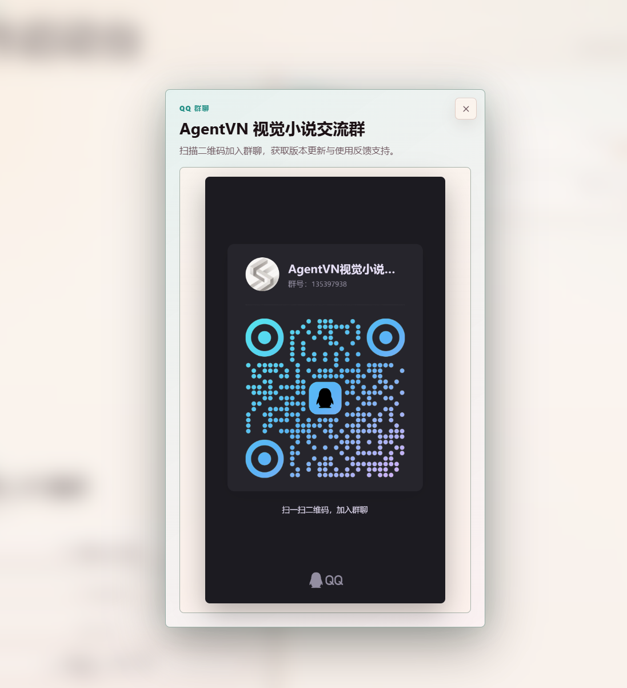
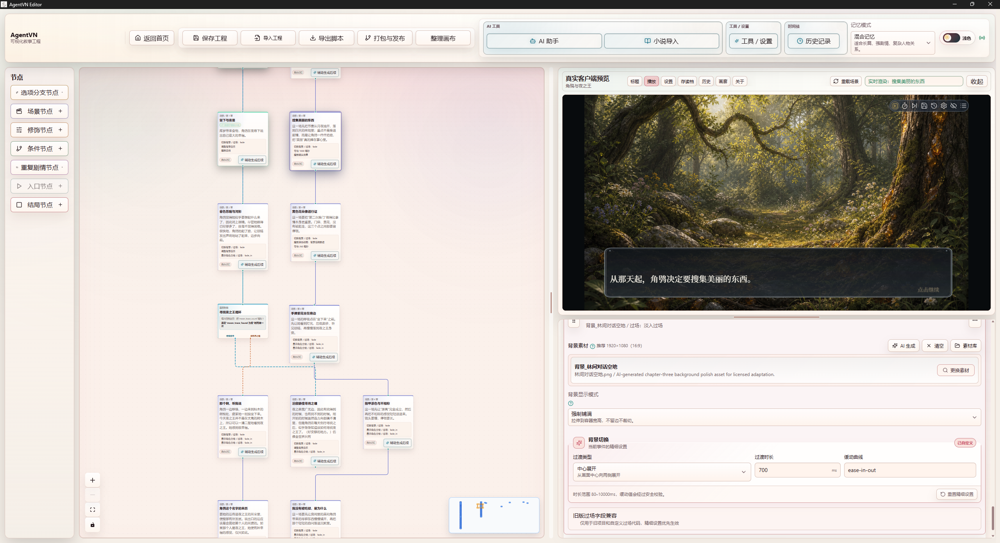
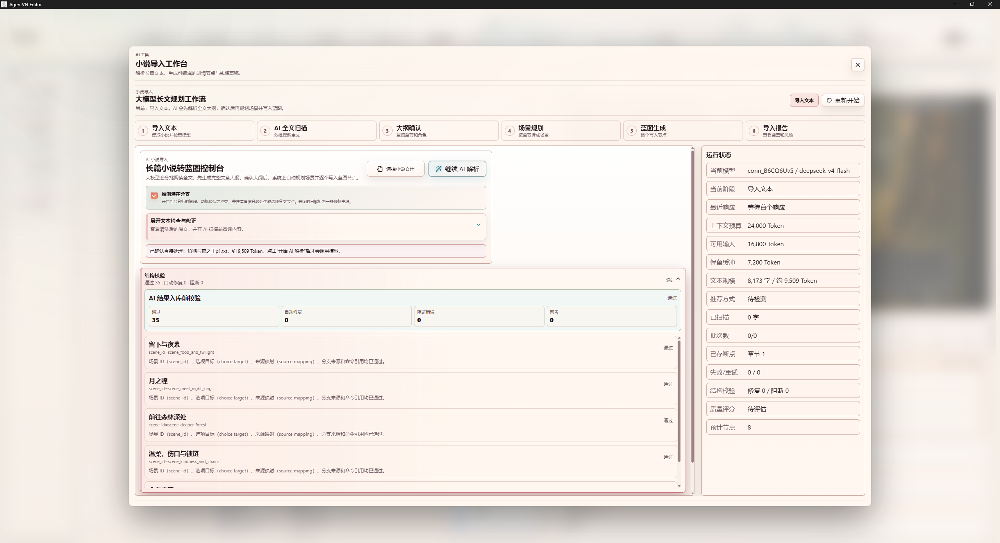
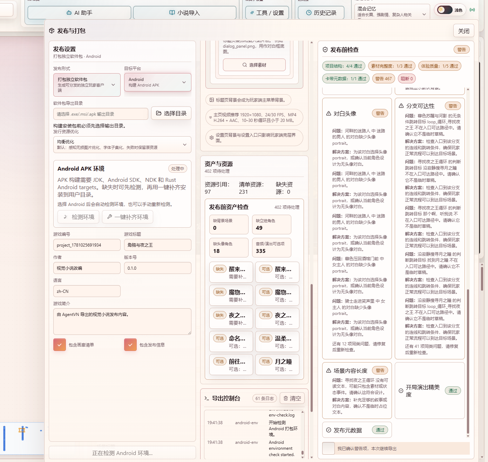

<div align="center">

# AgentVN Editor

### 免费、零代码、Agent 辅助的视觉小说游戏引擎

AgentVN 是一个免费的视觉小说游戏引擎，旨在让用户无需编写代码，
即可制作和发布自己的视觉小说游戏。

项目同时引入 Agent 创作辅助功能，帮助创作者完成小说导入、剧情整理、
场景规划、内容生成、素材管理、运行预览与游戏打包。

[官方网站](https://agentvn.space) · [GitHub 仓库](https://github.com/aqualite2370/AgentVN-Editor) · QQ 群：`135397938`

</div>

---

## 加入交流群

QQ群：**135397938**

扫码加入 AgentVN 视觉小说交流群，获取版本更新、使用交流与问题反馈支持。

<p align="center">
  
</p>

## 项目特点

- **零代码创作**：通过可视化节点、表单和实时预览组织剧情，无需编写程序。
- **Agent 创作辅助**：辅助分析文本、整理情节、规划场景并生成可编辑内容。
- **小说文本导入**：支持长篇文本解析、章节处理、结构校验和场景蓝图生成。
- **可视化编辑器**：集中管理剧情节点、分支、角色、背景、演出与游戏界面。
- **实时游戏预览**：在编辑器内直接查看视觉小说的实际运行效果。
- **素材与演出管理**：管理图片、音频、视频、动画、镜头和界面资源。
- **游戏发布打包**：导出 `.vncart` 游戏包，并支持独立玩家与桌面游戏打包流程。
- **商业游戏许可**：使用 AgentVN 制作的游戏可以商业发布和销售。

## 编辑器主界面

通过节点画布组织剧情流程，并在同一界面中实时预览玩家最终看到的游戏画面。



## Agent 小说导入

导入小说文本后，可借助 Agent 进行全文分析、章节拆分、剧情规划、结构校验和
场景蓝图生成，最终转换成可继续编辑的视觉小说工程。



## 游戏发布与打包

发布界面会检查项目结构、素材完整性、剧情分支和体验质量，并支持将作品导出
为玩家可运行的游戏内容。



## 项目组成

- `editor/`：可视化编辑器、Agent 辅助、小说导入、素材与发布功能。
- `backend/`：本地 AI 服务、结构化生成、小说处理、记忆与项目持久化。
- `GameCli_framework/`：视觉小说玩家与游戏运行时。
- `shared/`：编辑器和运行时共享的数据格式、校验与兼容逻辑。
- `docs/`：项目格式与功能文档。

## 本地开发

需要 Node.js 20+、Python 3.10+；构建桌面版本还需要 Rust 与 Tauri 环境。

```powershell
npm install
npm --prefix GameCli_framework install
npm --prefix editor install
```

启动后端：

```powershell
cd backend
python -m venv .venv
.\.venv\Scripts\Activate.ps1
pip install -e ".[dev]"
uvicorn app.main:app --reload --host 127.0.0.1 --port 8278
```

启动编辑器：

```powershell
cd editor
npm run dev
```

## 许可证

AgentVN Editor 由个人开发者 **AquaLite** 独立开发。源码可公开查看、学习、
研究和私下修改；未经授权不得商业化编辑器本身。使用编辑器制作的游戏及其他
输出作品可以商业使用和销售。

完整条款请查看 [中文许可证](LICENSE) 与 [英文法律原文](LICENSE.en.md)。
